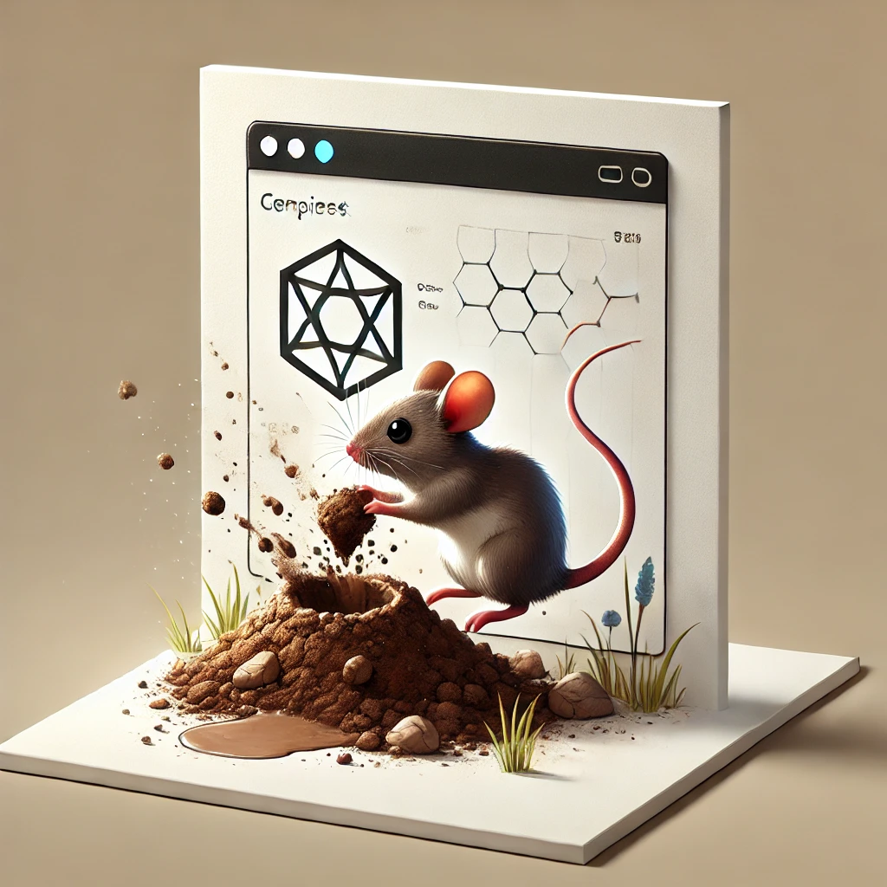

<div align="center">
  
</div>
<h1 align="center">Sichqon</h1>

<div align="center">
  <a href="https://npmjs.org/package/sichqon">
    
  </a>

  <a href="https://npmjs.org/package/sichqon">
    
  </a>
  <a href="https://packagephobia.now.sh/result?p=sichqon">
    
  </a>
</div>

<br />

<code>sichqon</code>  is a lightweight React library that provides a tunneling mechanism for rendering React components at different locations in your application's component tree. This library was inspired by <a href="https://github.com/pmndrs/tunnel-rat">tunnel-rat</a>, adopting a similar approach to component tunneling while maintaining its own lightweight implementation.

## Installation

```bash
npm install sichqon
# or
yarn add sichqon
# or
pnpm add sichqon
```

## Features

- 🪶 Lightweight and zero dependencies
- 🌳 Type-safe with TypeScript support
- ⚡ SSR compatible with isomorphic layout effects
- 🎯 Simple API with just two components: `In` and `Out`

## Usage

First, create a tunnel using the `createTunnel` function:

```tsx
import { createTunnel } from 'sichqon';

const MyTunnel = createTunnel();
```

Then use the tunnel's `In` and `Out` components to teleport content:

```tsx
function App() {
  return (
    <div>
      <h1>My App</h1>
      {/* Content sent through the tunnel */}
      <MyTunnel.In>
        <button>Teleported Button</button>
      </MyTunnel.In>
      
      {/* Other components */}
      <main>
        <p>Main content</p>
      </main>
      
      {/* Where the tunneled content appears */}
      <div className="portal-target">
        <MyTunnel.Out />
      </div>
    </div>
  );
}
```

## How It Works

Sichqon uses React's `useSyncExternalStore` hook to manage state synchronization between the `In` and `Out` components. The tunneling mechanism allows you to:

1. Send content from any part of your component tree using `<Tunnel.In>`
2. Render that content elsewhere using `<Tunnel.Out>`
3. Multiple `In` components can send content to the same `Out` component
4. Content is rendered in the order it was sent

## API Reference

### `createTunnel()`

Creates a new tunnel with `In` and `Out` components.

```tsx
const Tunnel = createTunnel();
```

### `<Tunnel.In>`

The component that accepts children to be tunneled.

Props:
- `children`: ReactNode - The content to be tunneled

### `<Tunnel.Out>`

The component that renders the tunneled content.

No props required.

## Server-Side Rendering

Sichqon is built with SSR in mind and uses an isomorphic layout effect to ensure consistent behavior between client and server environments.

## TypeScript Support

Sichqon is written in TypeScript and provides full type definitions out of the box.

## Examples

### Modal Portal

```tsx
const ModalTunnel = createTunnel();

function Modal({ children }) {
  return <ModalTunnel.In>{children}</ModalTunnel.In>;
}

function App() {
  return (
    <div>
      <Modal>
        <div className="modal">Modal Content</div>
      </Modal>
      
      {/* Modal container at the root level */}
      <div id="modal-root">
        <ModalTunnel.Out />
      </div>
    </div>
  );
}
```

### Toast Notifications

```tsx
const ToastTunnel = createTunnel();

function Toast({ message }) {
  return (
    <ToastTunnel.In>
      <div className="toast">{message}</div>
    </ToastTunnel.In>
  );
}

function App() {
  return (
    <div>
      <Toast message="Operation successful!" />
      
      {/* Toast container */}
      <div className="toast-container">
        <ToastTunnel.Out />
      </div>
    </div>
  );
}
```

## Contributing

Contributions are welcome! Please feel free to submit a Pull Request.